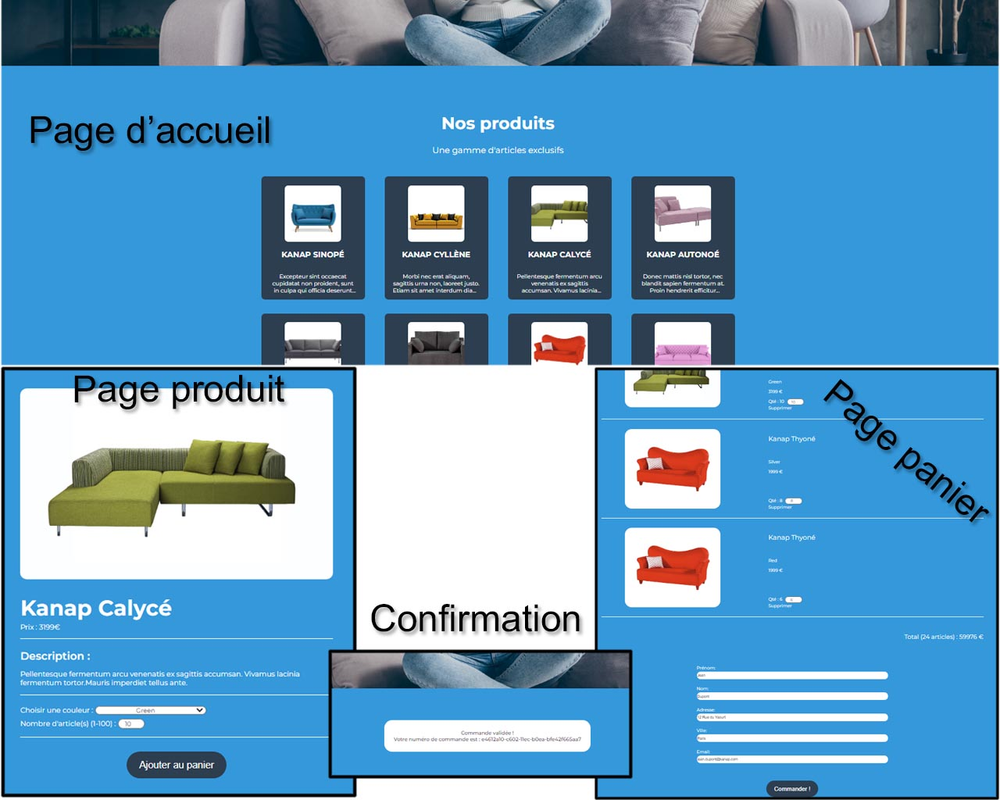

# Kanap
## _Construction d'un site e-commerce en JavaScript_


5ème projet de la formation de développeur web d'OpenClassroom.



## Enjeux
---
- Intégration dynamique d'éléments de l'API dans les différentes pages web avec JavaScript.
- Mise en place d'un test d'acceptation à partir d'un template fourni.

## Livrables attendus
---
### Architecture générale du site

- Page d'accueil avec affichage dynamique de tous les articles à la vente.
- Page produit avec affichage dynamique des détails du produit sur lequel l'utilisateur a cliqué depuis la page d'accueil avec possibilité de sélectionner une quantité, une couleur et d'ajouter le produit à son panier.
- Page panier contenant :
-- Un résumé des produits dans le panier, le prix total et la possibilité de modifier la quantité d'un produit sélectionné ou de supprimer celui-ci.
-- Un formulaire permettant de passer une commande avec renvoi au serveur des données formatéees.
- Page confirmation affichant un message de confirmation de commande renvoyé par l'API.

### Planification de tests

- Un plan de test d'accpetation couvrant l'ensemble des fonctionnalités du site.

### Spécifications techniques

**Page d’accueil**
- La page présente l'ensemble des produits retournés par l'API.
- Pour chaque produit, il faudra afficher l'image de celui-ci, ainsi que son nom et le début de sa description.
- En cliquant sur le produit, l’utilisateur sera redirigé sur la page du produit pour consulter celui-ci plus en détail.

**Page produit**
- Cette page présente un seul produit ; elle aura un menu déroulant permettant à l'utilisateur de choisir une option de personnalisation, ainsi qu’un input pour saisir la quantité. Ces éléments doivent être pris en compte dans le panier.

**Page panier**
- Sur cette page, l’utilisateur va pouvoir modifier la quantité d’un produit de son panier ; à cemoment, le total du panier devra bien se mettre à jour.
- L’utilisateur aura aussi la possibilité de supprimer un produit de son panier, le produit devra donc disparaître de la page.
- Les inputs des utilisateurs doivent être analysés et validés pour vérifier le format et le type de données avant l’envoi à l’API. Il ne serait par exemple pas recevable d’accepter un prénom contenant des chiffres, ou une adresse e-mail ne contenant pas de symbole “@”. En
cas de problème de saisie, un message d’erreur devra être affiché en dessous du champ
correspondant.

**Page confirmation**
- Sur cette page, l'utilisateur doit voir s’afficher son numéro de commande. Il faudra veiller à ce que ce numéro ne soit stocké nulle part.

## Technologies utilisées
---
- [HTML] - Version 5
- [CSS] - Version 3
- [JS] - JavaScript
- [VScode] - Editeur de code

## Contraintes techniques
---
**Code source**
- Le code source est indenté et utilise des commentaires en début de chaque fonction pour décrire son rôle.
- Il est découpé en plusieurs fonctions réutilisables. Les fonctions sont courtes et répondent à un besoin précis.

**API**
- Les promesses sont utilisées pour éviter les callbacks. Utilisation de fetch.
- A notre que la requête ne prend pas encore en compte la quantité ni la couleur des produits achetés.
- L'URL de l'API : http://localhost:3000/api/products
- Chaque API contient 3 paramètres : GET/ -- GET/{product-ID} -- POST/order

**Fonctionnement du panier**
- Dans le panier, les produits doivent toujours apparaître de manière regroupée par modèle et par couleur.
- Si un produit est ajouté dans le panier à plusieurs reprises, avec la même couleur, celui-ci ne doit apparaître qu’une seule fois, mais avec le nombre d’exemplaires ajusté.
- Si un produit est ajouté dans le panier à plusieurs reprises, mais avec des couleurs
différentes, il doit apparaître en deux lignes distinctes avec la couleur et la quantité
correspondantes indiquées à chaque fois.

## Installation
---
# Kanap #

Cloner le projet
```terminal
git clone https://github.com/KLdvl/OC_P5_Kanap_KM.git
```
This is the front end and back end server for Project 5 of the Web Developer path.

### Back end Prerequisites ###

You will need to have Node and `npm` installed locally on your machine.

### Back end Installation ###

Clone this repo. From the "back" folder of the project, run `npm install`. You
can then run the server with `node server`.
The server should run on `localhost` with default port `3000`. If the
server runs on another port for any reason, this is printed to the
console when the server starts, e.g. `Listening on port 3001`.